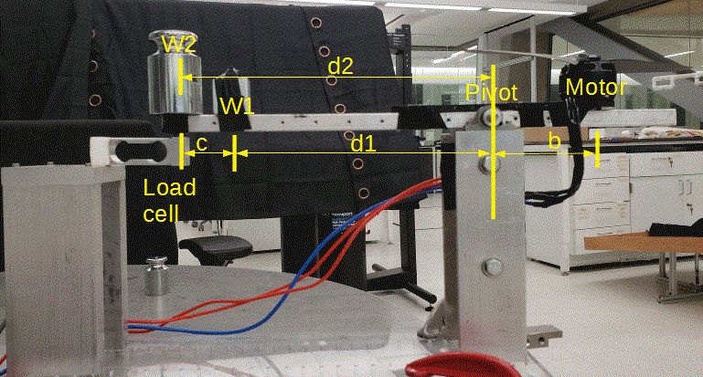
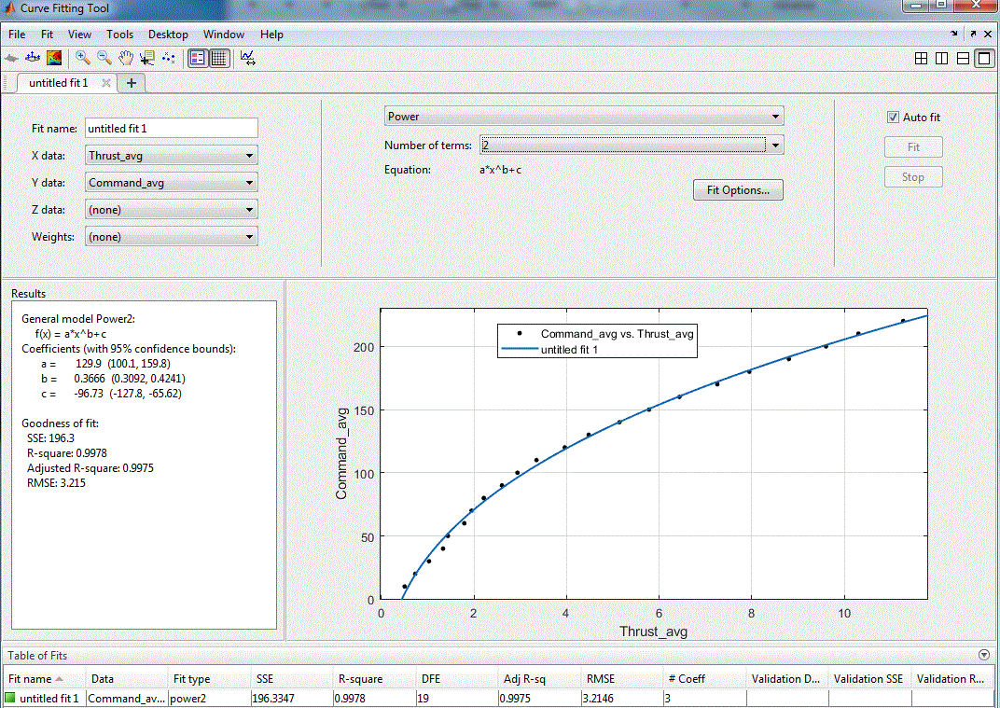

This repository includes the code and the instructions for testing motors and measuring the relation between motor thrust and torque and throttle command using a load cell(**Omega LCAE-3KG**). 

# Contents
1. [Setting-up the Repositoy](#setting-up-the-repository)
1. [Hardware Setup](#hardware-setup)
1. [Motor Calibration](#motor-calibration)
1. [Post Processing](#post-processing)

# Setting-up the repository

Open a terminal in the desired directory and clone the repository:
```sh
git clone https://github.com/fdcl-gwu/Motor_Tests
cd Motor_Tests
```

## Dependencies
1. Arduino IDE: download the latest version of Arduino from https://www.arduino.cc/en/Main/Software.
2. pyserial library: `pip install pyserial`


After the installation is finished, open Arduino IDE, select the correct `Board` from `Tools` in the menu bar (for example "Arduino Due")
After plugging-in the Arduino board with a USB to the computer, also select the correct `Port` under `Tools`.


# Hardware Setup



1. Attach the motor to the test rig as shown above. 
1. Measure the distance between the pivot and motor (`b`), the pivot and sensor (`d1`), and the weight `W2` and pivot (`d2`). If `d2` is set to be `d1 + c`, calculations become simpler.
2. Connect the Arduino to the force sensor and the ESC using the following connections: 

    **ESC <---> Arduino**
    ``` 
    C   <---> A5  
    D   <---> A4  
    Gnd <---> Gnd 
    ```
    **Strain meter <---> Arduino**  
    ```
    10* <---> A0  
    12* <---> Gnd  
    ```
    **Load cell<---> Strain meter**  
    ```
    Red wire   (+Excitation) <---> 2* (OUT +E in TB2 section)
    White wire (-Negative)   <---> 1* (OUT -E in TB2 section)
    Green wire (+Signal)     <---> 6* (+S IN in TB2 section)
    Black wire (-Signal)     <---> 7* (-S IN in TB2 Section)
    ```

4. Find the maximum load (`W_max`) that can be applied at the rig at the motor end. Do not apply higher force on the load cell than this value as it may damage the sensor.
    1. `W1`: dead weight which will be always on the rig to avoid unnecesary vibrations and impacts on the load cell during the motor startup
    2. `W2`: variable weighs
    3. `W_motor`: motor weight (including the propellers attached)
    4. `F_max_allowed`: maximum load the laod cell can measure, for the LCAE-3KG sensor, this is `3 kg`, which is roughly equal to `3.0 * 9.81 = 29.43 N`.
    ```
    W2_max = (F_max_allowed * (d1 + c) + W_motor * b - W1 * d1) / d2 (N)
    m2_max = W2_max / 9.8 / 1000 (gram)
    ```
    **DO NOT** not use a mass heavier more than `m2_max`.

<!-- 
## Measure the maximum thrust that the load cell can measure:

In other words, measure the amount of force that the load cell should measure if the motor provides the maximum thrust.

`T_max` is the maximum thrust of the motor. For **Tiger 700** motor and **11*3.7 CF** propeller, it is `12.04 N`.

```
F_max_thrust = (T_max*b-W_motor*b+W1 d1)/(d1+c) (N)
```

If `F_max_thrust` is greater than `F_max_allowed`, then decrease `b` and increase `d1 + c`. 


## Measure the maximum torque that the load cell can measure:

In other words, measure the amount of force that the load cell should measure if the motor provides the maximum torque.

```
F_max_torque = (tau_max-W_motor*b+W1*d1)/(d1+c).
```

Again here, if `F_max_torque` is greater than `F_max_allowed`, then decrease `b` and increase `d1 + c`.  -->

# Motor Calibration

Motor calibration consists of finding two relationships:
1. meter calibration: analog output read by the Arduino <=> actual value on the load cell
1. thrust calibration: actual load on the load cell <=> command value written to the ESC

## Meter Calibration

1. Turn on the load cell  
   _**NOTE**: The force sensor may need a few minutes to warm up. Values may start higher or lower than expected but will normalize after several minutes._

1. Update `python_scripts/record.py`:
    1. Update the line `location = '/dev/ttyACM0'` with the specific port name corresponding to the Arduino. To find the port name, in the Terminal write:
        ```
        ls /dev/tty*
        ```
    1. Create a directory specific to the motor propeller combination, ex `tiger_ms1101` and update the `<data dir>` in `text_file = open('../<data dir>/calib_0.txt', 'w')` with it's name.
1. Run the meter calibration:
    1. Make sure no weights are on the bar except for the motor with attached propeller and `W1`.
    1. Press `TARE` button on the meter.
    1. Upload `strain_reader.ino` to the Arduino.
    1. Run `record.py` for several seconds to determine the reading with zero thrust (must need atleast 2000 lines of readings). From `python_scripts` directory:
        ```
        python record.py
        ```
    1. Add a known mass (`W2`), for example `46 gram`, to the rig and change the file name in `record.py`. A recommended file name, for `46 gram` mass, is `calib_46.txt`. Run `record.py` again.
    1. Repeat step 4, for different masses (total 4 should be enough). Make sure that you do not overload the load cell.
    1. Go through each text file to make sure all the data will be readable and correct. For example, within the first few data points, somtimes "332" will be shortened to "32". This will affect your calibration so those incorrect values should be removed from the data set.

## Motor Calibration

**NOTE**: read all the below steps before continuing them

1. Remove `W2`, but leave `W1`.
1. Set the power supply to  a fixed voltage that you would expect your battery to supply.
1. Make sure you are safe from the rotating propellers, and wear safety glasses.
1. Attach the motor to the power supply. 
    **NOTE**: The Voltage may drift during the tests so be prepared to adjust the supply accordingly.
1. Upload `step_test.ino` to the Arduino board.
1. Update the file name, a recommended file name is `motor_calib_<voltage>.txt`)
1. Run `record.py `.
1. The code is going to run the motor at a specific command for a while and stop. Then increase the command and run again and stop. 
1. This will continue from the motor command of 10 until 250.
1. The whole process is going to take around 10 minutes, make sure no one else goes near the propeller during the process.

<!-- 8) Repeat steps 4-6 for each voltage you want to test. Let the motor cool between each test to keep the data consistent. It is important to do a force calibration before or after every test as the force sensor's readings could change. -->

**NOTE**: Make sure that the propellers are blowing wind downside, otherwise reverse two of the motor wires.

# Post processing the data
1. Make a new folder, and copy all the calibration text files as well as motor test data text files in it.
2. From the folder called "Post_process_Matlab_files", copy all the three mfiles to the folder that you made it.
3. Run post_porcess_thrust_test.m (instructions are provided inside the mfile) to compute and plot all required data from the thrust test. You may change the name of the text files which you saved from your experiment.
4. Run post_porcess_torque_test.m (instructions are provided inside the mfile) to compute and plot all required data from the torque test.
5. To compute C_tau, run compute_C_tau (instructions are provided inside the mfile). 

The results of processing data for Tiger 700 motor and 11*3.7 CF propeller with 14.8 V & 16.2 V are provided, and for 14.8 is summarized  in the Report folder inside the "tiger_5_31_2018_14p8 volt" folder.

```
thrust = p1*throttle^2 + p2*throttle + p3
```

From 14.8V:  C_tau=0.0135.

From 16.2V: p1 = 0.0002036, p2 = 0.003627, p3 = 0.6563. So, throttle=sqrt((thrust-p3)/p1+p2^2/4/p1/p1)-p2/2/p1
or you can type "cftool" in Matlab command, and fit a function to data:


# Find voltage and throttle relationships
Run analysis.py to filter data and format it for graphing. Be sure to update the file paths and tailor the data analysis to fit your own needs.

Using the data from analysis.py, you can run escVolt2cmd.py, escVolt2cmd_send.py, inputVolt2cmd.py, or inputVolt2cmd_send.py. Before running either of the send programs, do a force calibration, input the v1, v2, d, b, and m values into cmd_reader.ino, and then upload cmd_reader to the arduino. 
- inputVolt2cmd.py calculates the proper command given the desired force and input voltage
- inputVolt2cmd_send.py does the calculations of inputVolt2cmd.py and sends the command to the ESC.
- escVolt2cmd_send.py reads voltage from the ESC, takes the desired force and calculates the proper command. It continuously updates the command based on the changing voltage.
- escVot2cmd.py simulates the behavior of escVolt2cmd_send.py by predicting the voltage change from a command change.

# Making your own analysis script
If you want to make your own analysis script, there are a few things to keep in mind:
* The ESC is sending bad data if the maxPWM value is less than 255 so you will need to filter out those data points
* The data includes a few seconds where the motor is not spinning. It is a good idea to filter out all data with rpm value below a certain min rpm (e.g. 10)
* There is a risetime on the load cell so you will also need to cut all data within the risetime. Risetime will differ for each loadcell, but for our setup, removing the first 150 data points (after all the other filtering) was sufficient.


Data from the following motors are included:
- robbe Roxxy BL-Motor 2827-35, 760kv. 10x4.5 prop
- tiger mn3110-17, 700kv. 10x4.7 prop

